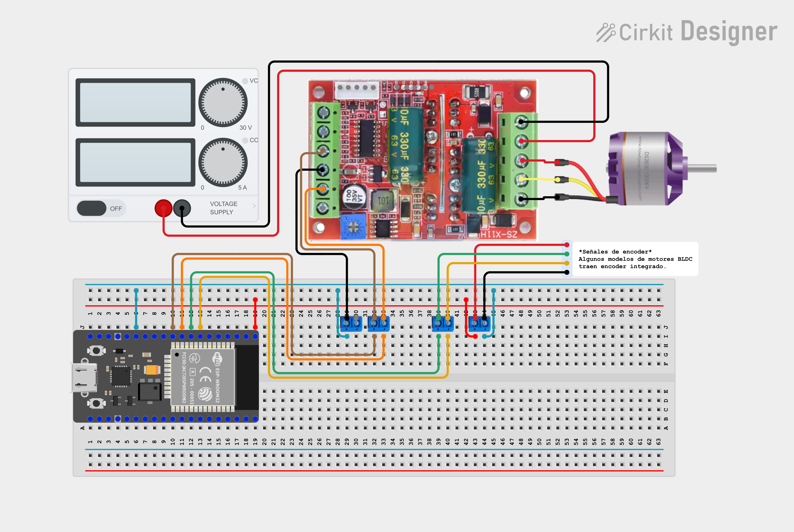

# motor_bldc_as_joint.control.idf
Repositorio que contiene el ejemplo de control básico de posición de un motor BLDC con encoder de cuadratura con ESP32 e IDF de Espressif.

### Connection

### Control diagram

### Programming infrastructure
